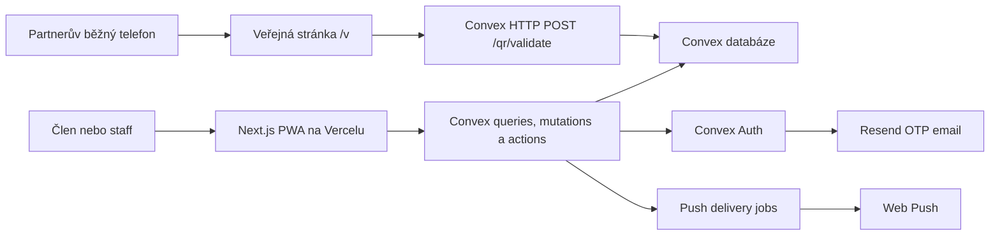
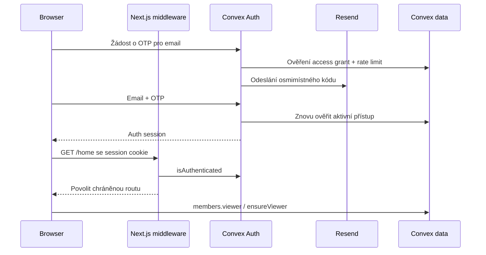

# Architektura

Aktualizováno: 17. 7. 2026

## Systémový přehled



Convex je jediný runtime backend a zdroj pravdy. Next.js poskytuje UI, routing, session middleware, bezpečnostní hlavičky a PWA shell. Resend neposkytuje identitu ani databázi; pouze doručuje OTP email vytvořený auth flow.

## Hranice odpovědností

### Next.js

- veřejné a chráněné stránky,
- mobile-first React UI,
- Convex Auth middleware a cookie session,
- český/anglický locale stav,
- manifest, service worker a install walkthrough,
- bezpečnostní a `no-store` hlavičky,
- offline snapshot pouze pro neautoritativní čtení.

### Convex

- allowlist a aktivní členství,
- serverová autentizace a autorizace,
- staff preset a scope,
- partneři, nabídky, approvals a hlášení,
- QR tokeny a atomická validace,
- agregované metriky,
- kampaně, push joby, události a check-in,
- audit, privacy workflow a retence.

### Veřejné QR API

`POST <NEXT_PUBLIC_CONVEX_SITE_URL>/qr/validate` je jediný veřejný doménový endpoint bez loginu. Přijímá QR secret nebo normalizovaný osmimístný kód, vrací minimální výsledek a používá `no-store` a CORS kontrolu podle `SITE_URL`.

## Struktura repozitáře

```text
nextjs-app/
  convex/                  # schéma, authz a doménové backend moduly
  docs/                    # aktuální produktová a technická dokumentace
  public/                  # service worker, offline shell a brand assety
  scripts/                 # build, browser testy a provisioning
  src/app/                 # Next.js routy
  src/components/          # hlavní produktové povrchy a providery
  src/hooks/               # locale, online stav a PWA install
  src/lib/                 # auth policy, i18n, PWA snapshot a utility
  src/ui/                  # sdílené design tokeny
  tests/                   # frontendové/unit testy
```

## Frontendové routy

Route ochranu definuje `src/lib/auth/routePolicy.ts` a vynucuje `src/proxy.ts`.

| Route | Komponenta | Poznámka |
|---|---|---|
| `/` | produktový přehled | Session přesměruje na `/home`. |
| `/login` | `ConvexLoginPanel` | Session přesměruje na požadovanou chráněnou routu. |
| `/home` | `ConvexMemberHome` | Chráněná členská aplikace. |
| `/workspace` | `ConvexWorkspace` | Chráněná routa; jednotlivé moduly dále řídí capabilities. |
| `/admin` | `ConvexAdminPanel` | Chráněná routa; administrativní operace kontroluje Convex. |
| `/v` | veřejná validace | QR secret je načten z URL fragmentu a z adresního řádku ihned odstraněn. |
| `/v/[tokenHash]` | kompatibilní přesměrování | Přesměruje starší tvar validace do bezpečného toku. |
| `/privacy` | privacy notice | Veřejná informační stránka. |

## Backendové moduly

| Modul | Odpovědnost |
|---|---|
| `auth.ts`, `ResendOTP.ts`, `otp.ts` | Convex Auth, osmimístné OTP, Resend a rate limit. |
| `members.ts`, `access.ts` | Profil, access grants, efektivní stav členství a bulk změny. |
| `iam.ts`, `permissions.ts`, `authz.ts` | Organizace, assignments, capabilities a scope kontrola. |
| `partners.ts`, `offers.ts`, `approvals.ts` | Partner a offer lifecycle. |
| `offerEngagement.ts` | Oblíbené, hlášení a post-redemption feedback. |
| `qrActions.ts`, `qr.ts`, `qrCrypto.ts`, `http.ts` | Vydání, hashování a veřejná validace QR. |
| `analytics.ts`, `analyticsModel.ts` | Agregované QR metriky. |
| `campaigns.ts`, `notifications.ts`, `notificationsNode.ts` | Kampaně, push subscriptions, fronta a odeslání. |
| `events.ts` | Event lifecycle, eligible members a check-in. |
| `feedback.ts` | Obecný feedback a návrhy partnerů. |
| `privacy.ts`, `retention.ts`, `crons.ts` | Export, práva subjektu, anonymizace a denní cleanup. |
| `support.ts` | Účelově omezený členský adresář pro support. |

## Auth a session



Middleware chrání navigaci, ale doménová bezpečnost je v Convexu. Citlivé funkce vždy znovu ověřují aktivní membership/access grant a capability.

## Autorizační vzor

Každý chráněný backend handler používá jeden z těchto vstupů:

- `requireActiveMember(ctx)` pro členské self-service funkce,
- `requireCapability(ctx, capability, targetScope)` pro staff workflow.

`targetScope` obsahuje `organizationId` a volitelný `branchId`. Organization assignment povolí všechny zdroje dané organizace; branch assignment pouze přesnou pobočku.

## PWA architektura

- Manifest startuje na `/home?source=pwa` a používá `standalone`.
- Service worker se registruje pouze v produkčním buildu.
- Chráněné, auth, QR a privacy routy jsou `NetworkOnly`.
- Navigace používá síť a při výpadku pouze obecný `offline.html`.
- Cachují se jen statické Next.js chunky, fonty, obrázky a brand assety.
- Členský offline snapshot je v IndexedDB, má verzi a maximální stáří 24 hodin.
- Snapshot neobsahuje OTP, session secret ani aktivní QR secret.
- Logout maže snapshot a posílá service workeru `CLEAR_PRIVATE_CACHES`.

## Realtime

Convex queries automaticky aktualizují:

- členské nabídky a oblíbené,
- stav právě vydaného QR po veřejném skenu,
- management seznamy po mutaci,
- fronty hlášení a privacy požadavků.

Klient nesmí realtime stav považovat za oprávnění. Mutation znovu validuje aktuální databázi.

## Bezpečnostní hlavičky

`next.config.ts` nastavuje CSP, HSTS, ochranu proti framingu, omezení permissions a `no-store` pro citlivé routy. Produkční Convex URL mají fallback přímo v konfiguraci, aby Vercel build nemohl omylem skončit s development endpointem.
