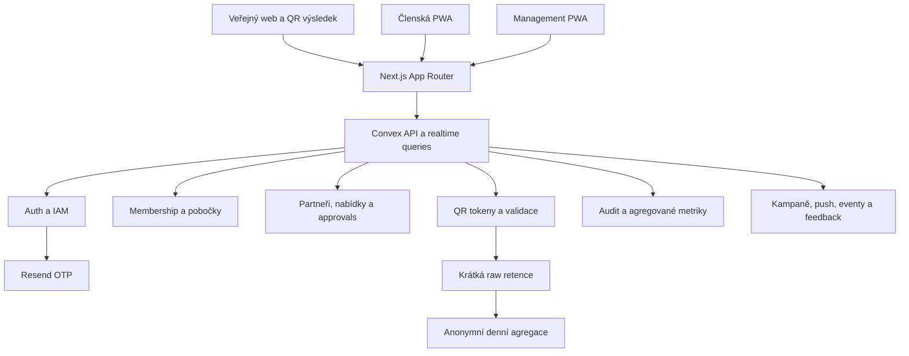

# Psychočas: cílová architektura a plán od MVP po beta pilot

Aktualizováno: 12. 7. 2026

## 1. Rozhodnutí

Psychočas bude jedna mobile-first PWA nad Next.js a Convexem. Convex bude jediný produkční zdroj pravdy pro identitu, členství, organizační oprávnění, partnery, nabídky, QR tokeny, audit a agregované metriky. Resend zůstane pouze doručovací službou pro emailové OTP.

Oprávnění nebudou postavena jen na jednom poli `role`. Cílem je kombinace:

- role preset určující typ práce
- scope určující, zda oprávnění platí celostátně nebo pro konkrétní pobočku
- serverová capability kontrola u každé query, mutation, action a HTTP action

Tento model umožní například celostátního PR koordinátora, lokálního koordinátora partnerství pro Brno a support s omezenou diagnostikou bez přístupu k členské aktivitě.

QR skeny mají platformu učit, které nabídky fungují. Budou ale vytvářet jen krátkodobé provozní události a anonymní denní agregace. Psychočas nebude stavět profil jednotlivého člena podle toho, kde a jaké slevy používá.

## 2. Aktuální stav a mezery

### Co už funguje

- Convex Auth s emailovým OTP přes Resend funguje v development prostředí.
- Přihlásit se může jen email s aktivním přístupem nebo první bezpečně bootstrapovaný admin.
- Citlivé membership funkce znovu ověřují aktuální `accessGrant`, takže revokace nezávisí jen na existující session.
- Board/admin umí přidávat, filtrovat, označovat a hromadně upravovat členství.
- Manifest, service worker, offline dokument a správně velké brand ikony se generují.
- Veřejná pitch stránka ve zkoušeném mobilním viewportu nemá horizontální přetečení.
- Aplikace i Convex TypeScript procházejí; 13 testovacích souborů a 54 testů je zelených.

### Co ještě není Convex MVP

- Nabídky, slevy, tokeny, veřejné QR ověření, statistiky, profil a část managementu stále používají Supabase.
- Convex schéma pro tyto oblasti existuje, ale chybí k němu produkční query, mutations, actions a UI.
- Současné role jsou jen `member`, `manager`, `board`, `admin`; support a koordinátoři nejsou modelováni.
- `manager` má jen jednoduchou kontrolu pobočky, ne ucelený capability model.
- Convex admin UI pokrývá pouze členy a pobočky.
- Veřejná Supabase validace stále vrací jméno člena a přesné datum členství. Cílová validace tyto osobní údaje nesmí vracet.
- Legacy offline snapshot umí uložit email, jméno a aktivní token do `localStorage`. To se nesmí přenést do cílové PWA.
- Neexistuje privacy centrum, proces práv subjektů, retenční automatizace ani schválený záznam činností zpracování.

### PWA a security mezery

- `next-pwa` je starý build wrapper a v produkčním dependency stromu přináší zranitelné Workbox závislosti.
- `npm audit --omit=dev` aktuálně hlásí 20 zranitelností, z toho 13 high. Přímé high nálezy se týkají `next` a `next-pwa`.
- Současný service worker používá `skipWaiting: true` a obecný `NetworkFirst` pro dokumenty. Tím může cachovat personalizované HTML/RSC odpovědi a po deployi aktivovat novou verzi uprostřed relace.
- Convex endpointy nejsou v cache kontraktu explicitně `NetworkOnly`.
- `/sw.js` se nyní vrací s `public, max-age=0`; cílově má mít `no-cache, no-store, must-revalidate` a striktní content type/CSP.
- Chybí produkční security headers a ověřený update flow nainstalované aplikace.
- Vlastní install prompt založený na `beforeinstallprompt` nepokrývá iOS Safari. iOS potřebuje vlastní stručný postup instalace.

### Release závěr

Login je použitelný základ, ale pilot nesmí začít, dokud:

- runtime nepoužívá jediný backend
- server nevynucuje scoped oprávnění
- QR nefunguje bezpečně a bez PII
- PWA neprojde reálným install/offline/update testem
- nejsou uzavřené GDPR dokumenty a procesy
- nejsou odstraněné přímé high/critical dependency nálezy nebo formálně přijaté jejich mitigace

## 3. Produktové povrchy

### Veřejná část

- stručný pitch a vize
- email OTP login
- veřejný QR výsledek bez účtu
- privacy notice, podmínky a kontakt na podporu

### Členská aplikace

- domov se stavem členství
- národní a lokální výhody podle pobočky
- detail nabídky a vytvoření krátkodobého QR
- profil a nastavení soukromí/notifikací
- feedback a návrh partnera
- později události a check-in

### Management aplikace

- pracovní úkoly podle oprávnění
- členové a pobočky
- partneři a nabídky
- návrhy a approval workflow
- kampaně, eventy a notifikace
- anonymní metriky
- audit a privacy požadavky pouze pro oprávněné osoby

Partner nebude mít účet ani dashboard. QR naskenuje běžným fotoaparátem telefonu a uvidí pouze jednoznačný stav nabídky a členství.

## 4. Cílová systémová architektura



Zásady:

- Next.js proxy je UX vrstva, ne bezpečnostní hranice.
- Každá veřejná Convex funkce validuje argumenty a oprávnění sama.
- Klient nikdy neposílá důvěryhodný `branchId` nebo scope bez serverového ověření cílového zdroje.
- Veřejné API vrací malé účelové view modely, ne databázové dokumenty.
- Mutace mají doménová jména jako `offers.submitForApproval`, ne generické klientské CRUD.
- Vedlejší efekty, například push kampaně, používají outbox/job záznam s retry stavem.
- Audit je append-only a obsahuje minimální diff, ne celé kopie dokumentů s PII.

Navržené členění kódu:

```text
convex/
  auth/
  iam/
  membership/
  organization/
  partners/
  offers/
  approvals/
  qr/
  analytics/
  notifications/
  events/
  feedback/
  privacy/
  audit/
  shared/authz.ts
  shared/audit.ts
  shared/scope.ts

src/features/
  auth/
  member-home/
  offers/
  qr-card/
  profile/
  management/
  privacy/
  pwa/
```

## 5. Organizace, role a least privilege

### Scope model

V MVP budou dva typy scope:

- `organization`: celostátní Psychočas
- `branch`: jedna konkrétní pobočka

Každý spravovaný zdroj má vlastníka nebo viditelnost v jednom z těchto scope. Národní nabídka patří organizaci. Lokální nabídka patří pobočce. Server scope vždy odvodí z uloženého zdroje, ne pouze z argumentu klienta.

### Role presety

| Preset | Účel | Typický scope |
|---|---|---|
| `member` | vlastní členství, nabídky, QR, feedback | vlastní účet |
| `support` | omezená diagnostika loginu a ticketů bez behaviorálních dat | organization nebo branch |
| `coordinator_hr` | omezený seznam členů, příprava importu a membership návrhů | organization nebo branch |
| `coordinator_pr` | obsah, kampaně a návrhy notifikací | organization nebo branch |
| `coordinator_partnerships` | návrhy, partneři a nabídky | organization nebo branch |
| `coordinator_events` | eventy a check-in provoz | organization nebo branch |
| `manager` | lokální schvalování, tým a agregované pobočkové metriky | branch |
| `board` | celostátní business governance, členství a schvalování | organization |
| `admin` | IAM, technická konfigurace a incidentní zásah | organization |

`agent` nebude obecná role s širokými právy. Člověk dostane konkrétní coordinator preset a scope podle své práce.

### Governance pravidla

- Členství aktivuje, ruší, prodlužuje nebo mění role pouze `board` a `admin`.
- HR koordinátor může připravit import nebo návrh změny, ale nemůže ho sám aplikovat.
- Partnerships koordinátor vytváří a upravuje drafty ve svém scope.
- Lokální manager schvaluje a publikuje lokální nabídky své pobočky.
- Národní nabídku publikuje board; národní koordinátor ji může připravit.
- PR koordinátor připraví kampaň. Hromadné odeslání schvaluje manager lokálně nebo board celostátně.
- Event koordinátor vidí jen účast nutnou pro konkrétní event, ne historii slev.
- Support vidí stav účtu, poslední úspěšný login a anonymizovaný email-delivery stav. Nevidí OTP, tokeny ani seznam použitých nabídek.
- Admin používá rozšířená práva pro IAM a incident. Citlivé použití je auditované a v produkci označené jako break-glass.
- Nelze odebrat posledního aktivního board/admin správce ani si bez druhého potvrzení uzamknout vlastní účet.

### Capability model

Presety se v kódu mapují na capability klíče, například:

```text
membership.self.read
membership.directory.read_limited
membership.change
assignment.manage
partner.draft
partner.approve
offer.draft
offer.publish
campaign.draft
campaign.send
event.manage
event.check_in
metrics.read_aggregate
support.session_revoke
audit.read
privacy_request.manage
```

Každá citlivá funkce začíná voláním ve stylu:

```ts
const actor = await requireCapability(ctx, "offer.publish", targetScope);
```

MVP nebude mít editor libovolných jednotlivých capability. Admin přiřadí ověřený preset a scope. Tím se výrazně sníží riziko chybné konfigurace.

## 6. Cílový datový model

### Identity a členství

- `users`: auth identita a minimální technická metadata
- `accessGrants`: kanonické oprávnění k loginu a členství
- `members`: vazba auth identity na `accessGrant`, bez duplicitní role/platnosti
- `organizations`: jedna organizace v MVP, explicitní kořen pro national scope
- `branches`: lokální organizační jednotky
- `staffAssignments`: preset, scope, stav, platnost, důvod a audit metadata

Migrační pravidlo: stávající `accessGrants.role` zůstane dočasně pro kompatibilitu loginu, ale management oprávnění se přesunou do `staffAssignments`. Členský status nebude záviset na staff roli.

`expired` nebude ručně ukládaný membership stav. Bude se odvozovat z `membershipUntil`; ručně řízené stavy budou `active`, `inactive`, `revoked`.

### Partneři, nabídky a workflow

- `partners`: značka/organizace partnera bez implicitního scope
- `partnerships`: vztah Psychočasu s partnerem, owner scope a stav
- `partnerLocations`: volitelné lokální provozovny
- `offers`: obsah a lifecycle nabídky
- `offerTargets`: organization nebo jedna či více poboček
- `approvalRequests`: typ entity, požadovaná akce, stav, reviewer a komentář
- `campaigns`: sezónní seskupení nabídek a komunikace

Stavy nabídky:

```text
draft -> pending_approval -> published -> paused -> archived
```

Publikovaná nabídka se neupravuje přímo. Významná změna vytvoří novou revizi/draft, aby audit vysvětlil, co člen v danou chvíli viděl.

### QR a analytika

- `tokens`: member, offer, hash tajemství, stav a expirace
- `tokenEvents`: krátkodobé provozní události bez raw IP
- `analyticsDaily`: denní agregace podle pobočky, partnera a nabídky
- `analyticsRetentionRuns`: doklad, že raw události byly agregovány a odstraněny

### Komunikace, eventy a feedback

- `notificationPreferences`: explicitní preference člena podle kanálu a tématu
- `pushSubscriptions`: zařízení, endpoint a revoke stav
- `deliveryJobs`: outbox, pokusy, poslední chyba a idempotency key
- `events` a `eventCheckIns`
- `feedback` a `partnerSuggestions`

### Accountability a GDPR

- `auditLogs`: minimální diff citlivých změn
- `securityEvents`: rate limits, revokace session a podezřelé operace bez zbytečné PII
- `privacyRequests`: access, correction, deletion, restriction a objection workflow
- `retentionPolicies`: schválená pravidla po kategoriích dat
- `retentionRuns`: audit automatického mazání/anonymizace

Volné texty, například feedback a support poznámky, musí mít limit délky, upozornění nevkládat citlivé údaje a samostatnou retenci.

## 7. Bezpečný QR tok a learning loop

### Vydání

1. Přihlášený člen otevře aktivní nabídku.
2. `qr.issue` ověří aktivní členství, target nabídky, termín, rate limit a případný existující token.
3. Vygeneruje minimálně 128bit náhodné tajemství a krátký záložní kód.
4. V databázi uloží pouze HMAC/hash, nikdy čitelné tajemství.
5. Token je vázaný na nabídku, platí například 3 minuty a je jednorázový.

### Sken

1. QR otevře statický shell `/v#t=<secret>`, takže tajemství není v URL cestě ani běžném access logu.
2. Shell odešle tajemství pomocí POST do veřejné Convex HTTP action.
3. Mutation atomicky zkontroluje hash, stav, expiraci, nabídku a aktuální členství.
4. První validní sken nastaví stav na `consumed` a vrátí `valid_first_scan`.
5. Další sken vrátí `already_validated` a původní čas. Nikdy nevytvoří druhé použití.

### Veřejný výsledek

Zobrazí pouze:

- platné, neplatné, expirované nebo již ověřené
- partnera, název a hodnotu nabídky
- čas ověření
- obecné potvrzení aktivního členství

Nezobrazí jméno, email, pobočku, členské ID ani přesné datum členství.

### Co se z QR naučíme

Agregovaný funnel:

```text
zobrazená nabídka -> vydaný token -> sken -> validní použití -> opakovaný/neplatný sken
```

Board uvidí národní agregace. Manager jen agregace své pobočky. Koordinátor partnerství uvidí agregace zdrojů, které spravuje. Nebude existovat tabulka typu „člen X použil nabídku Y“ pro běžný management.

Pokud by nabídka mohla nepřímo odhalovat zdraví nebo jinou citlivou oblast, členská vazba se odstraní ihned po dokončení validace a analytika zůstane pouze agregovaná.

## 8. PWA architektura

### Manifest a instalace

- typovaný `src/app/manifest.ts`
- stabilní `id`, `scope` a `start_url`
- správné 192, 512, maskable 512, Apple 180 a notification badge ikony
- vlastní brand screenshoty pro install UI až po stabilizaci členského shellu
- Android install prompt pouze po uživatelské akci
- iOS stručný postup přes Sdílet -> Přidat na plochu

### Service worker

`next-pwa` bude odstraněn. Pro MVP bude malý ručně řízený service worker podle aktuálního Next.js PWA postupu.

| Data/routa | Strategie |
|---|---|
| fingerprintované JS/CSS a brand assety | `CacheFirst` s verzovanou cache |
| veřejný pitch a offline shell | `NetworkFirst` s offline fallbackem |
| personalizované HTML/RSC | `NetworkOnly` |
| `/api/auth` a OTP | `NetworkOnly` |
| `*.convex.cloud` a `*.convex.site` | `NetworkOnly` |
| `/v`, QR issue/validate a short code | `NetworkOnly`, `no-store` |
| management a privacy operace | `NetworkOnly`, `no-store` |

Nebude se automaticky cachovat start URL po přihlášení. Service worker nebude automaticky `skipWaiting`; při nové verzi aplikace zobrazí bezpečnou výzvu k obnovení.

Headers pro `/sw.js`:

```text
Content-Type: application/javascript; charset=utf-8
Cache-Control: no-cache, no-store, must-revalidate
Content-Security-Policy: default-src 'self'; script-src 'self'
```

### Offline data

IndexedDB snapshot bude obsahovat pouze:

- obecný stav členství a platnost
- pobočku
- poslední publikované nabídky
- `updatedAt` a `expiresAt`

Nebude obsahovat:

- OTP nebo session secret
- aktivní QR tajemství nebo short code
- historii použití
- support/audit data

Snapshot bude verzovaný, krátce platný, oddělený podle user ID a odstraněný při logoutu, změně účtu nebo revokaci. Offline UI jasně označí čas poslední aktualizace. QR nelze offline vytvořit ani ověřit.

### Push

- pouze explicitní opt-in po vysvětlení témat
- oddělená volba pro eventy, členství a nabídky
- žádný citlivý obsah v lock-screen notifikaci
- invalidní endpoint se automaticky revokuje
- unsubscribe odstraní subscription i serverový záznam
- odesílání používá approval, outbox, idempotency key a retry limit

## 9. GDPR readiness

Technická implementace sama nemůže prohlásit organizaci za plně GDPR compliant. Release vyžaduje současně právní rozhodnutí, dokumentaci, smlouvy, procesy a ověřené technické kontroly. Toto je implementační checklist, ne právní stanovisko.

### Povinné organizační kroky

- určit přesného správce údajů, kontaktní údaje a privacy kontakt
- popsat účely, kategorie údajů, subjekty, příjemce a právní tituly
- vést záznamy o činnostech zpracování
- schválit retenční plán a proces práv subjektů
- provést a zdokumentovat DPIA screening; u potenciálně citlivých behaviorálních údajů doporučeně plnou risk assessment
- uzavřít DPA se zpracovateli a vést registr subprocesorů
- mít incident/breach runbook včetně posouzení 72hodinové ohlašovací povinnosti
- proškolit board, adminy, support a koordinátory v práci s osobními údaji

### Produkční infrastruktura

- vytvořit produkční Convex deployment v `EU West (Ireland)`
- region existujícího deploymentu nejde změnit; pokud není EU, vytvořit nový deployment a data migrovat
- podepsat a archivovat Convex DPA
- podepsat a archivovat Resend DPA a ověřit transfer/subprocessor podmínky
- ověřit DPA, region a log retention hostingu Next.js aplikace
- preview deploymenty plnit jen syntetickými daty
- dev, preview a production mají oddělené klíče, databáze a domény

### Privacy by design

- veřejný QR výsledek bez PII
- žádný raw IP v aplikačních tabulkách
- žádná třetí strana pro marketingovou analytiku v pilotu
- žádný member-level usage dashboard
- minimální audit diff místo celých `before/after` dokumentů
- serverový least privilege a pravidelná recertifikace staff assignments
- šifrování při přenosu a u poskytovatele v klidu
- secret rotation, dependency patching a pravidelné security testy

### Práva člena

Privacy centrum poskytne:

- přehled zpracovávaných kategorií a účelů
- žádost o kopii dat
- opravu kontaktních/profilových údajů
- žádost o výmaz, omezení nebo námitku
- správu push souhlasů
- kontakt a stav požadavku

Výmaz není automatický bez posouzení. Některá data může být nutné držet kvůli právní povinnosti nebo obhajobě nároků; rozhodnutí musí vycházet ze schváleného právního titulu.

### Navržené retenční výchozí hodnoty

Tyto hodnoty musí před pilotem schválit správce/právník:

| Kategorie | Návrh |
|---|---|
| OTP rate-limit záznamy | 24 hodin |
| auth/security logy | 90 dní |
| aktivní QR token | do expirace, technický záznam nejvýše 24 hodin |
| raw token events | 30 dní, poté agregace a odstranění členské vazby |
| anonymní denní agregace | 24 měsíců |
| support ticket | 12 měsíců po uzavření |
| feedback/návrh partnera | 12 měsíců po uzavření nebo anonymizace |
| push subscription | do odhlášení/revokace, invalidní ihned smazat |
| staff audit | 24 měsíců |
| privacy request | 3 roky pro prokázání vyřízení |
| členství | dle schváleného účelu a právních povinností organizace |

### Specifické privacy riziko

Použití nabídky může podle typu partnera nepřímo naznačit citlivé zájmy nebo zdravotní kontext. Proto se v pilotu nesmí používat behaviorální personalizace, member-level historie ani žebříčky. Nabídky ze zdravotně citlivých kategorií musí projít zvláštním DPIA/risk posouzením.

## 10. Výkon, spolehlivost a provoz

Absolutní bezchybnost nelze technicky garantovat. Cílem je měřitelná spolehlivost, fail-closed bezpečnost a rychlá obnova.

### Technická pravidla

- správné indexy pro každý produkční filtr; žádné neomezené `.collect()` nad velkou tabulkou
- stránkování členů, auditů a nabídek
- atomické Convex mutations pro tokeny, approvals a bulk změny
- idempotency key pro importy, kampaně, notifikace a externí side effects
- rate limit pro OTP, token issue, veřejnou validaci a feedback
- feature flags/kill switches pro QR, push, kampaně a event check-in
- automatizované cron úlohy pro expiraci, agregaci a retenci
- sanitizované provozní logy bez OTP, token secretů a volného PII

### Prostředí

- `development`: reálný dev auth, testovací členové, žádná produkční data
- `preview`: syntetická data a vypnuté reálné hromadné odesílání
- `production`: EU Convex, produkční doména, oddělený Resend/VAPID a omezený dashboard přístup

### Pilotní SLO a alerty

- QR validace p95 do 1,5 s při běžném mobilním připojení
- 99,5 % úspěšných aplikačních požadavků mimo chyby uživatele
- alespoň 95 % OTP loginů dokončených do dvou pokusů
- 100 % souběžných skenů stejného tokenu s právě jedním prvním validním výsledkem
- alert na zvýšené OTP delivery errors, validační chyby a failed delivery jobs
- denní kontrola error rate v prvním týdnu pilotu, poté týdenní

### Zálohy a obnova

- před pilotem otestovaný Convex export a restore do neprodukčního deploymentu
- minimálně denní produkční backup/export podle zvoleného plánu
- runbook pro ztracený telefon, kompromitovaný staff účet, chybnou bulk změnu a výpadek Resendu
- auditovaný emergency revoke sessions a kill switch QR

### Convex Auth beta riziko

Convex Auth a jeho Next.js podpora jsou stále označené jako beta/experimental. Proto:

- přesně pinovat verzi auth balíčku
- neaktualizovat automaticky před pilotem bez regression testu
- mít E2E login test pro browser, iOS PWA a Android PWA
- před produkcí provést restart/refresh/session expiry/revocation test
- zachovat dokumentovaný exit plan na standardní OIDC provider, pokud beta auth selže v release gates

## 11. Mobile-first UI/UX podle uživatele

### Student/člen

Spodní navigace má čtyři cíle:

- Domů
- Výhody
- QR karta
- Profil

První viewport ukáže brand, stav členství, platnost, pobočku a jednu jasnou primární akci. QR karta nebude současně dlouhý dashboard. Nabídky mají filtry Národní, Moje pobočka, kategorie a brzy končící.

### Support

Jedna vyhledávací obrazovka s účelově omezeným výsledkem:

- stav přístupu
- poslední úspěšný login
- stav posledního email delivery eventu bez obsahu/OTP
- možnost revokovat session podle capability
- odkaz na ticket a audit zásahu

### Koordinátoři

Pracovní dashboard podle presetu:

- Moje drafty
- Čeká na schválení
- Publikované
- Vráceno k doplnění

Koordinátor neuvidí moduly, pro které nemá capability. National/local scope bude vždy viditelný v hlavičce pracovního prostoru.

### Manager

- local work queue
- schvalování lokálních partnerů, nabídek, eventů a kampaní
- správa lokálních assignmentů, pokud ji board deleguje
- pouze agregované metriky vlastní pobočky

### Board/admin

- členové s filtry a bulk akcemi
- pobočky
- národní approvals
- role assignments
- agregované metriky
- audit, privacy requesty a incident controls podle capability

Management bude na mobilu používat kompaktní seznam, filter drawer a sticky bulk action bar. Na desktopu hustou tabulku se stejnými funkcemi. Žádné vnořené karty a žádné marketingové hero uvnitř pracovní aplikace.

## 12. MVP, pilot a další užitečné funkce

### Funkční MVP musí obsahovat

- Convex-only runtime
- OTP login a bezpečný logout
- membership, pobočky, staff assignments a scoped authz
- board/admin bulk membership
- partner/offer CRUD a national/local approvals
- členský seznam nabídek
- issue, QR scan a veřejnou validaci
- agregované QR metriky pro manager/board
- mobile-first členský a management shell
- installovatelnou PWA, bezpečný offline snapshot a update flow
- privacy notice, preference, request workflow, retenci a audit
- feedback a návrh partnera

### Beta pilot za feature flags

- kampaně a sezónní nabídky
- push notifikace s opt-inem a approval
- eventy a check-in
- dlouhodobé spolupráce jako Praktická psychologie a Nakladatelství Portál v běžném partner/campaign workflow
- support diagnostika a session revoke

### Po stabilním pilotu

- uložené oblíbené nabídky pouze lokálně nebo s jasným privacy účelem
- anonymní hlasování, o které typy partnerů je zájem
- membership expiry reminders
- Apple/Google Wallet pass, pokud přinese hodnotu nad PWA
- partner-specific QR display kit bez partner účtu
- export anonymních reportů pro výroční zprávu

Nepřidávat behaviorální doporučování, členské žebříčky ani partner dashboard bez nového účelu, privacy review a důkazu z pilotu.

## 13. Implementační plán

### Fáze 0: security a PWA baseline

- aktualizovat Next.js a odstranit přímé high dependency nálezy
- odstranit `next-pwa` a zavést ruční service worker
- přidat security/no-store headers
- opravit přenositelný verify/build skript
- odstranit veřejné demo routy před spuštěním pilotu
- přidat CI pro lint, typy, testy, build a audit gate

Hotovo, když produkční build nemá otevřený přímý high/critical nález, service worker necachuje personalizované routy a install shell funguje přes HTTPS.

### Fáze 1: IAM a organizační scope

- přidat `organizations` a `staffAssignments`
- vytvořit capability registry a `requireCapability`
- migrovat board/admin/manager oprávnění z jednoho role pole
- přidat assignment management pro board/admin
- přidat ochranu posledního správce a self-lockoutu

Hotovo, když automatické testy prokážou deny-by-default a všechny cross-branch pokusy managera/koordinátora selžou na serveru.

### Fáze 2: membership, pobočky a support

- odstranit duplicitní membership pravdu z `members`
- stránkování, filtry, select-all-by-filter a bezpečné bulk změny
- CSV import s dry-run, diffem a idempotency key
- support read model bez usage historie
- audit každé změny a session revoke

Hotovo, když board/admin obslouží pilotní seznam bez zásahu do kódu a nikdo jiný membership nezmění přímým API voláním.

### Fáze 3: partneři, nabídky a approvals

- implementovat Convex partner/partnership/offer API
- přidat national/local target model
- přidat lifecycle a approval requests
- vytvořit coordinator/manager/board management UI
- migrovat data ze Supabase a vypnout legacy manage flow

Hotovo, když lokální coordinator/manager nemůže číst ani měnit cizí pobočku a národní publikace vyžaduje board capability.

### Fáze 4: QR a privacy-preserving analytics

- issue/current/revoke token
- veřejný POST validate endpoint přes URL fragment
- atomická one-time validace a short-code fallback
- token events, denní agregace a retention cron
- nový veřejný result screen bez PII
- rate limits, no-store a concurrency testy

Hotovo, když reálný sken na druhém telefonu funguje bez loginu a dva souběžné skeny mají právě jeden první validní výsledek.

### Fáze 5: členský mobile shell a offline

- domov, nabídky, detail, QR karta a profil
- IndexedDB snapshot s minimálními daty
- offline/reconnect/logout/update UX
- iOS install instrukce a Android prompt
- odstranit všechny členské Supabase importy

Hotovo, když hlavní flow funguje na 360, 390 a 430 px a offline nikdy nezobrazí aktivní QR jako autoritativní.

### Fáze 6: coordinator workspaces a metriky

- role-adaptive management navigation
- support a coordinator work queues
- branch/national dashboards z `analyticsDaily`
- feedback a partner suggestions s approval
- export anonymního reportu

Hotovo, když každý preset vidí jen svoje úkoly, scope a agregace.

### Fáze 7: GDPR operationalization

- privacy notice a privacy centrum
- záznam činností, data map a retention matrix
- DPA/subprocessor registr a EU deployment verification
- privacy request workflow
- retention crony a důkaz běhu
- DPIA/risk screening a incident tabletop test

Hotovo, když technické a organizační release položky schválí odpovědná osoba Psychočasu.

### Fáze 8: kampaně, push a eventy

- campaign scheduler a approvals
- push preferences, subscriptions a delivery outbox
- event management a check-in
- privacy-safe event/notification metriky
- feature flags a kill switches

Hotovo, když bez opt-inu neodejde push, duplicita jobu neodešle zprávu dvakrát a event coordinator nevidí data mimo svůj event/scope.

### Fáze 9: release candidate

- odstranit runtime Supabase, legacy auth callbacky a technician flow
- E2E, accessibility, security, offline a update testy
- production EU deployment a data import dry-run
- backup/restore a incident runbooks
- reálný device matrix

Hotovo, když není známá P0/P1 chyba a celý release checklist je zelený.

### Fáze 10: beta pilot

- 1-2 pobočky
- 20-50 členů
- 3-5 partnerů
- 2-4 týdny
- beta označení a feedback kanál
- denní monitoring první týden, poté týdenní review

Pilotní cíle:

- board/admin zvládne členy, assignments a nabídky bez vývojáře
- manager/coordinator nikdy nepřekročí scope
- QR nemá stale cache ani PII leak
- OTP a PWA fungují na iPhone i Androidu
- retenční a privacy request proces je proveditelný
- metriky ukážou hodnotu nabídek bez profilování členů

## 14. Testovací strategie

### Unit

- membership effective status
- capability preset a scope matching
- offer lifecycle a termíny
- token hash/countdown/status
- anonymizační view model
- offline snapshot allowlist
- retention policy výpočet

### Convex integration

- každá veřejná funkce volaná každým presetem
- national vs local cross-scope útok
- expired/revoked login a okamžitá revokace
- bulk patch mění jen uvedená pole
- assignment self-lockout a poslední admin
- approval state machine
- atomická QR concurrency
- analytics agregace bez member ID
- retention job a minimální audit diff

### Browser E2E

- OTP request, verify, refresh, restart PWA a logout
- member -> offer -> QR -> public scan
- board bulk membership a CSV dry-run
- coordinator draft -> manager/board approval
- offline, reconnect a update available
- privacy request a push preference
- žádné console errors ani horizontální overflow

Viewporty:

- 360 x 800
- 390 x 844
- 430 x 932
- 768 x 1024
- 1440 x 900 management

Reálná zařízení:

- aktuální iPhone/iOS PWA
- Android Chrome PWA
- mobilní Safari/Chrome bez instalace
- druhý telefon pro skutečný QR scan

### Security testy

- direct API authorization bypass
- replay a double scan
- XSS ve volných textech
- CSV formula injection v exportu
- rate-limit abuse
- stale service-worker cache po logoutu
- secret/PII scan build artefaktů a logů

## 15. Vstupy od Psychočasu

Vývoj Fáze 0-4 může pokračovat se syntetickými daty. Před produkčním pilotem jsou potřeba:

### Governance a role

- seznam pilotních poboček
- kdo je board, admin, manager, support a jednotliví koordinátoři
- national/local scope každého staff účtu
- potvrzení approval pravidel pro lokální a národní publikaci
- potvrzení, že membership změny zůstávají jen board/admin

### GDPR a provoz

- přesný název právnické osoby správce, sídlo/IČO a privacy kontakt
- schválené účely a právní tituly s právníkem/odpovědnou osobou
- schválené retenční doby
- pravidla pro členy mladší 18 let, pokud se mohou objevit
- kontakt a eskalace pro incidenty a support
- potvrzení DPA pro Convex, Resend a hosting
- produkční Convex deployment v EU West

### Pilotní data a obsah

- CSV členů bez nadbytečných polí
- seznam partnerů, nabídek, podmínek, scope a platnosti
- produkční URL, doporučeně `app.psychocas.cz`
- text privacy notice a podmínek po právní kontrole
- rozhodnutí pilot pouze česky, nebo česky i anglicky
- 2-4 testeři, alespoň jeden iPhone a jeden Android

### Až pro Fázi 8

- VAPID klíče uložené pouze v production env
- témata a text opt-inu pro push
- pravidla event check-inu
- campaign calendar a schvalovatelé

Do chatu ani repozitáře se neposílají API klíče, privátní JWT klíče ani produkční export členů.

## 16. Definition of Done pro funkční MVP

MVP je hotové pouze tehdy, když současně platí:

- Convex je jediný runtime backend.
- Aktivní člen se přihlásí OTP v browseru i nainstalované PWA.
- Revokovaný člen okamžitě ztratí přístup k citlivým funkcím.
- Staff oprávnění jsou capability + scope a server je vynucuje.
- Board/admin spravuje členy a assignments bez zásahu vývojáře.
- Koordinátoři a manager spravují pouze povolené národní/lokální zdroje.
- Člen vidí správné nabídky pro organization a svoji pobočku.
- QR funguje po skenu běžným telefonem bez partner loginu.
- Veřejný výsledek neobsahuje PII a není cachovaný.
- QR metriky jsou agregované a raw události mají retenci.
- PWA install, offline, reconnect, update a logout jsou ověřené na iOS/Android.
- Privacy notice, rights workflow, DPA, retention a incident proces jsou schválené.
- Build, lint, typy, unit, integration, E2E, accessibility a security gates procházejí.
- Neexistuje otevřená P0/P1 chyba ani nepřijatý přímý high/critical bezpečnostní nález.

## 17. První pracovní balík

Nejbližší implementace má být:

1. Fáze 0: dependency, service worker, security headers a CI gate.
2. Fáze 1: `organizations`, `staffAssignments`, capability registry a scope testy.
3. Fáze 2: kanonické členství, stránkování a bezpečný import.

Teprve nad tím se připojí partner/offer workflow a QR. Tím se zabrání tomu, aby nové funkce vznikaly na dnešním hybridním backendu a neúplném role modelu.

## 18. Aktuální autoritativní reference

- GDPR, Regulation (EU) 2016/679: https://eur-lex.europa.eu/eli/reg/2016/679/oj
- EDPB Guidelines 4/2019, Data Protection by Design and by Default: https://www.edpb.europa.eu/documents/guideline/guidelines-42019-on-article-25-data-protection-by-design-and-by-default_en
- ÚOOÚ základní příručka: https://uoou.gov.cz/index.php/verejnost/zakladni-prirucka-k-ochrane-udaju
- ÚOOÚ zpracovatel: https://uoou.gov.cz/poradna/poradna-gdpr/zpracovatel
- Convex regions: https://docs.convex.dev/production/regions
- Convex DPA: https://www.convex.dev/legal/dpa
- Convex security: https://www.convex.dev/security
- Convex Auth status: https://docs.convex.dev/auth/convex-auth
- Resend DPA: https://resend.com/legal/dpa
- Next.js PWA guide: https://nextjs.org/docs/app/guides/progressive-web-apps
