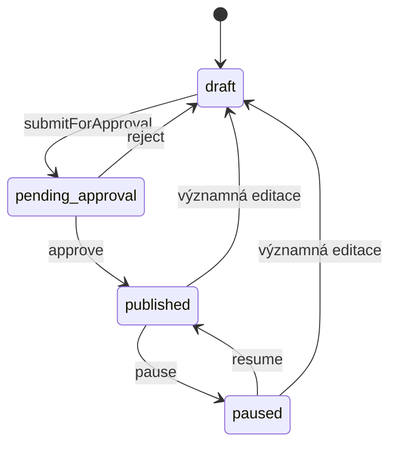
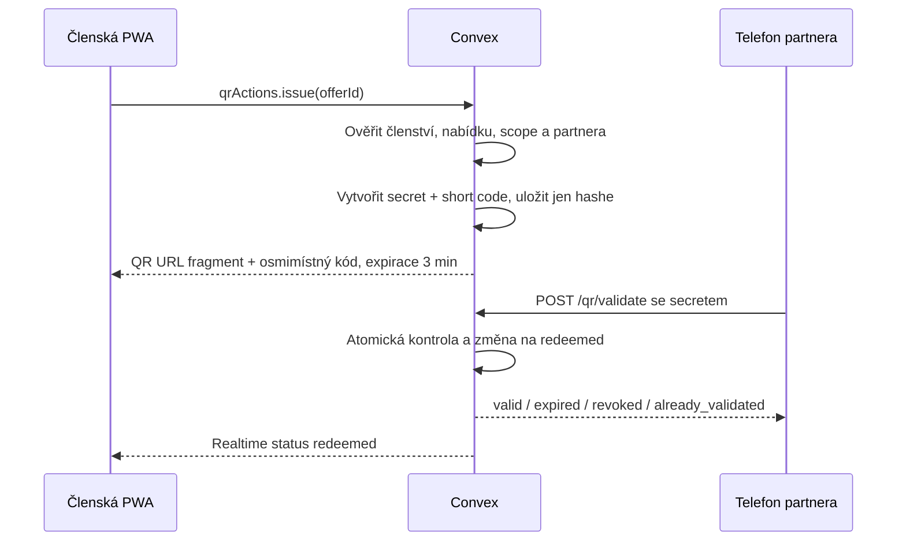

# Hlavní workflow

Aktualizováno: 17. 7. 2026

## 1. Přihlášení člena

1. Uživatel zadá email na `/login`.
2. Backend normalizuje email, ověří rate limit a existenci aktivního `accessGrant`.
3. Convex Auth vytvoří osmimístný OTP a Resend ho odešle z nakonfigurované adresy.
4. Uživatel zadá kód; backend znovu ověří oprávnění k přístupu.
5. Po úspěchu vznikne session a Next.js přesměruje na `/home`.
6. `members.viewer` načte členský profil. `members.ensureViewer` bezpečně synchronizuje vazbu auth identity na allowlist.
7. `iam.ensureBootstrap` připraví organizaci a kompatibilní staff assignment tam, kde je potřeba.

Email bez aktivního přístupu se nesmí přihlásit ani při znalosti dříve vydaného OTP.

## 2. Správa členství

1. Board/admin otevře `/admin`.
2. Seznam `accessGrants` lze filtrovat a označovat.
3. Jednotlivý záznam se vytvoří nebo upraví přes `members.upsertAccessGrant`.
4. Hromadná změna používá `members.bulkUpdateAccessGrants` a explicitní patch.
5. CSV import přijímá nejvýše 250 řádků se sloupci `email`, `fullName`, `branch`, `role`, `membershipUntil`, `status` a `notes`.
6. Klientský parser podporuje čárku i středník, české/anglické hlavičky a před potvrzením ukáže chyby, duplicity a nové/existující emaily.
7. `members.importAccessGrants` celý vstup znovu validuje, atomicky vytvoří nebo explicitně aktualizuje záznamy a chrání právě přihlášený admin účet před hromadným přepsáním.
8. Server vyžaduje board/admin oprávnění a uloží souhrnný audit bez obsahu celého CSV.
9. Efektivní stav bere v úvahu ruční status i `membershipUntil`.

CSV se po zpracování nikam neukládá. Pro import je doporučený formát data `RRRR-MM-DD`; prázdná role/stav použije bezpečný default `member`/`active`. Existující emaily jsou bez explicitního zaškrtnutí přeskočeny.

Staff assignment je samostatný od členství. Změna assignmentu nesmí nechtěně prodloužit nebo aktivovat členství.

## 3. Partner a nabídka

1. Uživatel s `partner.draft` vytvoří partnera ve svém scope.
2. Uživatel s `offer.draft` připraví název, hodnotu, popis, způsob uplatnění, podmínky a platnost.
3. Draft odešle ke schválení.
4. `offer.publish` schválí nebo vrátí nabídku.
5. Schválení nastaví `lastVerifiedAt` a nabídka se zobrazí oprávněným členům.
6. Pozastavená nebo expirovaná nabídka nejde použít pro nový QR.

Lokální nabídku vidí pouze člen stejné pobočky. Národní nabídku vidí všichni aktivní členové.

## 4. Discovery a oblíbené

`offers.listForViewer` vrací jen aktuálně použitelné nabídky a k každé připojí stav oblíbení konkrétního člena.

Člen může:

- hledat v názvu, partnerovi, hodnotě, popisu a kategorii,
- filtrovat národní/lokální nabídky a kategorii,
- řadit doporučené, nejnovější, nejdříve končící nebo podle partnera,
- zobrazit pouze oblíbené nebo nabídky končící do 14 dní,
- uložit nebo odebrat oblíbenou přes idempotentní `setFavorite`.

Doporučené pořadí není behaviorální profil. Upřednostní explicitní oblíbené, lokální scope a aktuálnost.

## 5. QR vydání a validace

Podrobnosti:

- nový QR revokuje předchozí aktivní token člena,
- secret je v `#fragment`, takže nejde do běžné serverové URL cesty,
- browser fragment po načtení odstraní z adresního řádku,
- databáze ukládá HMAC/hash secreta a short code, ne čitelnou hodnotu,
- první validní sken je jediný úspěšný first-use výsledek,
- veřejný výsledek obsahuje partnera, název a hodnotu nabídky, nikoli identitu člena,
- členská PWA po úspěchu nabídne jednorázový redemption feedback.

## 6. Hlášení problému a kvalita nabídky

1. Člen otevře detail nabídky nebo pokračuje z negativního QR feedbacku.
2. Vybere důvod a volitelně doplní text bez citlivých údajů.
3. Pro stejného člena a nabídku se existující otevřené hlášení aktualizuje místo vytváření duplicit.
4. Uživatel s `offer.draft` vidí hlášení pouze v povoleném scope.
5. Hlášení přechází `open -> reviewing -> resolved`; lze ho znovu otevřít.
6. Workspace nezobrazuje identitu člena, pouze nabídku, důvod, text a čas.
7. Vazba na člena se po 90 dnech anonymizuje.

Redemption feedback má hodnoty `accepted`, `not_accepted` nebo `problem`. Jeden token může mít jen jednu odpověď a management vidí pouze agregované počty.

## 7. Kampaň a push

1. `campaign.draft` připraví název, popis a období.
2. `campaign.send` publikuje a zařadí push joby.
3. Do fronty se zařadí pouze členové se zapnutou odpovídající preferencí a aktivní subscription.
4. Node action zpracuje pending jobs a uloží stav `sent`, `failed` nebo `cancelled`.
5. Kliknutí na notifikaci otevře cílovou URL v existující nebo nové PWA relaci.

Push vyžaduje oprávnění browseru i serverovou subscription. Vypnutí na zařízení subscription odstraní.

## 8. Událost a check-in

1. `event.manage` vytvoří draft v national/local scope.
2. Publikace nastaví událost jako naplánovanou nebo aktivní podle času.
3. Člen vidí pouze relevantní budoucí události.
4. `event.check_in` vyhledá eligible člena jménem nebo celým emailem v povoleném scope.
5. Check-in je idempotentní; druhý pokus vrátí `already_checked_in`.

## 9. Privacy self-service

- Profil umožní změnit tématické preference notifikací.
- `exportMyData` vytvoří strukturovaný JSON s profilem, assignments, QR aktivitou, feedbackem, oblíbenými, hlášeními a event attendance.
- Člen může podat access, correction, deletion, restriction nebo objection request.
- Oprávněný správce mění stav žádosti a doplní výsledek.
- Výmaz není automatický; žádost musí být posouzena podle schválených právních a retenčních pravidel.
